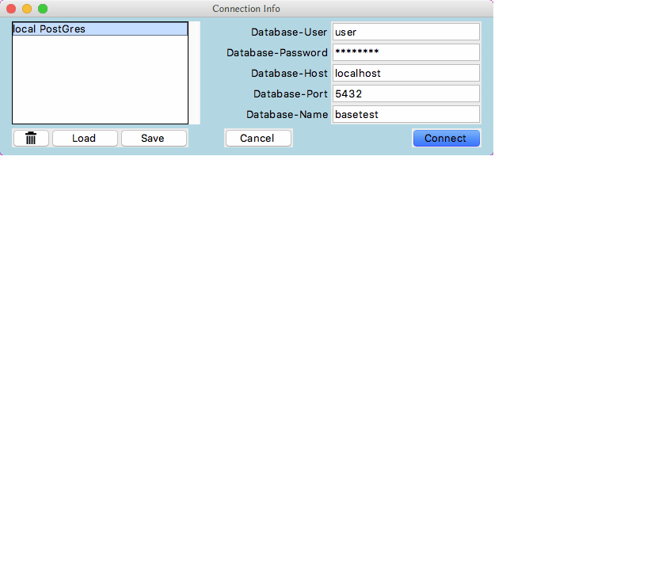

PgBrowse
===

PgBrowse is a PostgreSQL client. It will allow the user to connect to a PostgreSQL
database and execute SQL commands (and much more).

## Prerequistes:
  Tcl/Tk      (8.6 or better )
  TkTable     (2.8 or better )
  Img	      (Needed to view images)
  Tkhtml      (Needed to view html documentation)

## Installing

PgBrowse can be installed using the classic.

    ./configure
    make
    make install
In that case you will have a pgbrowse command available and a PgBrowse entry in your desktop menu.

You can too use it simply by calling the main script with tclsh :

    tlcsh pgBrowse.tcl

## Using

When the program starts a login dialog is presented to the user. After a successful
login is made a new window will appear. This window is split into three areas.

The top area (editor) is used to enter SQL code. The code can be extended over multiple lines.
The user can enter multiple ( semicolon separated ) sql commands if desired.

The status (grey colored) panel is used to display result codes and notices from the
backend processor. Good news is written in blue, bad news in red and notices in magenta.

The third area is used for displaying the rows from the last select statement.

### Executing the SQL code.

The user has several options available to execute the SQL code in the editor window.

   \<modifier-r\> (command=Apple key). Will send the contents of the entire window to
   the postgresql backend one statement at a time. I have implemented a very crude
   parser to separate the window into individual statements. A semicolon is deemed to
   be a statement separator if it is preceeded by an even number of single quotes.
   The result code of each of the statements will show in the status area. Only the
   last select statement will be displayed in the table area.

   \<shift-return\> will send any selected text to the back end. If no text is selected
   then the line containing the insertion point will be sent to the back end.

   \<shift-enter\> is the same as \<shift-return\>

## Future Directions (for version 2.0):

Using TTK for all widgets
Adding a toolbar to the requests window
Disable auto-commit mode by default (with Commit/Rollback buttons in toolbar)
Better use or replacing TKTable for a better text selection in row, better copy of row...
Adding auto-completion to the SQL request editor
